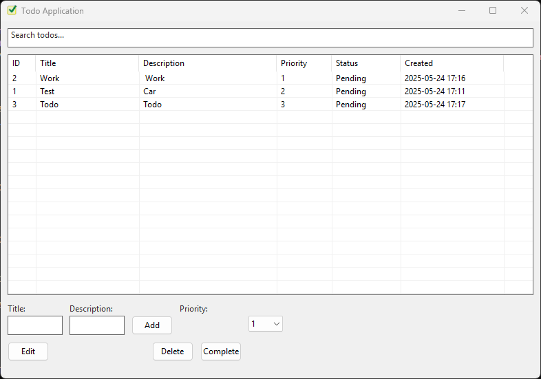

# 🌟 Simple Todo (C / WinAPI)


[](https://github.com/Efeckc17/simple-todo-c/releases)


A modern :) , native Windows Todo application built with C and Win32 API. This project demonstrates advanced Windows GUI programming and system integration capabilities.



## ✨ Features

- 📝 Create, edit, and delete todo items
- ✅ Mark tasks as complete
- 💾 Persistent storage in AppData
- 🔔 System tray integration (minimize to tray)
- 🌙 Native Windows look and feel
- 🚀 Auto-start with Windows option
- 🔍 Real-time search functionality with case-insensitive matching

## 🛠️ Technical Details

- Written in pure C
- Uses Win32 API for GUI
- System tray integration
- Lightweight native executable
- Modern Windows visual styles with manifest

## 💾 Data Storage

The application stores todos in a binary file:
- **Location**: `%APPDATA%\TodoApp\todos.dat`
- **Format**: Binary file containing the entire todo list
- **Capacity**: Maximum 100 todos


## 📋 Requirements

- Windows OS
- MinGW-w64 (GCC compiler)
- Windows SDK (included with MinGW)

## 🚀 Building from Source

1. Install MinGW-w64:
   - Download from [MinGW-w64 website](https://www.mingw-w64.org/downloads/)
   - Or use [MSYS2](https://www.msys2.org/)
   - Add MinGW's bin directory to your system PATH

2. Clone the repository:
   ```bash
   git clone https://github.com/Efeckc17/simple-todo-c.git
   cd simple-todo-c
   ```

3. Build the project:
   ```bash
   .\build.bat
   ```

## 🎮 Usage

1. Run `bin/todo.exe`
2. Use the interface to:
   - Add new todos with the "Add" button
   - Edit existing todos by selecting and clicking "Edit"
   - Delete todos with the "Delete" button
   - Mark todos as complete with the "Complete" button
   - Set priority levels for each todo

## 🏗️ Project Structure

```
.
├── src/
│   ├── app.manifest
│   ├── main.c           # Application entry point
│   ├── todo.c           # Todo management logic
│   ├── todo.h           # Todo data structures and declarations
│   ├── gui.c            # GUI implementation
│   └── utils/
│       ├── search.c     # Search functionality implementation
│       └── search.h     # Search function declarations
├── bin/                 # Compiled executable
├── build.bat            # Build script
└── README.md            # This file
```

## 🔧 Development

The project uses the following key components:

- **Win32 API**: For window management and GUI
- **Common Controls**: For modern UI elements
- **UXTheme**: For Windows visual styles
- **File I/O**: For data persistence

## 📝 License

This project is licensed under the MIT License - see the [LICENSE](LICENSE) file for details.

## 🤝 Contributing

Contributions are welcome! Please feel free to submit a Pull Request.

## 📫 Contact

Toxi360 - [@Efeckc17](https://github.com/Efeckc17)

Project Link: [https://github.com/Efeckc17/simple-todo-c](https://github.com/Efeckc17/simple-todo-c)
